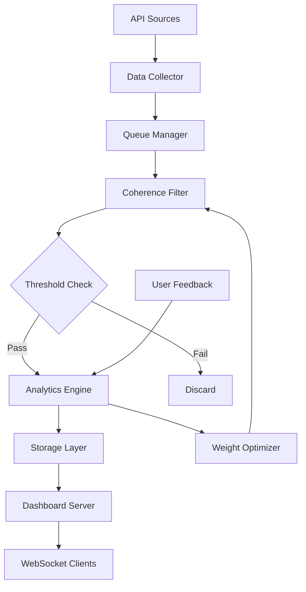

# 🏗️ ECNE Architecture Guide

## System Overview

ECNE (Enhanced Coherence Network Engine) is built using a modular, event-driven architecture that processes data streams through multiple stages of analysis and filtering.

## Core Components

### 1. Data River Collector (`src/collectors/`)

The entry point for all external data sources. Manages concurrent API requests with rate limiting and error handling.

**Key Features:**
- **Queue Management**: Controls concurrent API requests
- **Rate Limiting**: Respects API limits and handles 429 responses
- **Retry Logic**: Exponential backoff for failed requests
- **Error Recovery**: Graceful degradation when sources fail

```typescript
// Example configuration
const collector = new DataRiverCollector({
  sources: apiSources,
  maxConcurrent: 10,
  retryAttempts: 3,
  retryDelay: 1000
});
```

### 2. Coherence Filter (`src/core/`)

The heart of ECNE's intelligence. Analyzes incoming data using Grounded Coherence Theory principles.

**Components:**
- **Base Filter**: Core GCT implementation
- **Enhanced Filter**: Adds ML capabilities
- **A/B Tester**: Compare filter configurations

**Processing Pipeline:**
```
Data Point → Coherence Analysis → Scoring → Threshold Check → Output
            ↓                    ↓          ↓              ↓
         4 Dimensions        Weighted     Pass/Fail    Enhanced
         (Ψ,ρ,q,f)          Score        Decision     Data Point
```

### 3. Analytics Engine (`src/analytics/`)

Machine learning and statistical analysis components that enhance the basic filtering.

**Modules:**
- **Anomaly Detector**: Statistical outlier detection
- **Pattern Predictor**: Time-series forecasting
- **Weight Optimizer**: Auto-tuning based on feedback
- **Pattern Clusterer**: K-means clustering

### 4. Storage Layer (`src/storage/`)

Manages data persistence with time-series optimizations.

**Features:**
- **Time-series Storage**: Optimized for chronological data
- **Retention Policies**: Automatic cleanup of old data
- **Indexing**: Fast queries on common patterns
- **Mock Support**: In-memory storage for development

### 5. Dashboard Server (`src/dashboard/`)

Provides real-time visualization and user interaction.

**Capabilities:**
- **WebSocket Communication**: Real-time updates
- **RESTful API**: Data queries and configuration
- **Static File Serving**: Dashboard frontend
- **Health Monitoring**: System status endpoints

## Data Flow Architecture



## Component Interactions

### Event-Driven Architecture

ECNE uses an event-driven pattern where components communicate through events:

```typescript
// Data collection events
collector.on('data', (dataPoint) => filter.process(dataPoint));
collector.on('error', (error) => logger.error(error));

// Filter events  
filter.on('filtered', (dataPoint) => storage.store(dataPoint));
filter.on('anomaly', (anomaly) => dashboard.alert(anomaly));

// Analytics events
analytics.on('pattern-detected', (pattern) => dashboard.notify(pattern));
analytics.on('weights-updated', (weights) => filter.updateWeights(weights));
```

### Configuration Management

Centralized configuration with environment variable support:

```typescript
interface ECNEConfig {
  filter: FilterConfig;
  collector: CollectorConfig;
  storage: StorageConfig;
  dashboard: DashboardConfig;
}

// Environment-based configuration
const config = {
  filter: {
    sensitivity: parseFloat(process.env.COHERENCE_SENSITIVITY || '0.5'),
    weights: {
      psi: 0.25, rho: 0.25, q: 0.25, f: 0.25
    }
  }
  // ... other configs
};
```

## Scalability Considerations

### Horizontal Scaling

ECNE is designed to scale horizontally across multiple instances:

1. **Collector Scaling**: Multiple collectors can process different API sources
2. **Filter Scaling**: Coherence filtering can be distributed across workers
3. **Storage Scaling**: Database read replicas for query distribution
4. **Dashboard Scaling**: Load balancing for multiple dashboard instances

### Performance Optimizations

1. **Connection Pooling**: Reuse HTTP connections for API calls
2. **Batch Processing**: Group database operations
3. **Caching**: Redis for frequently accessed data
4. **Compression**: Gzip API responses and WebSocket messages

### Resource Management

```typescript
// Memory management
const bufferSize = parseInt(process.env.BUFFER_SIZE || '1000');
const memoryThreshold = parseInt(process.env.MEMORY_THRESHOLD || '512'); // MB

// CPU management  
const workerCount = parseInt(process.env.WORKER_COUNT || os.cpus().length);
```

## Error Handling Strategy

### Graceful Degradation

ECNE continues operating even when components fail:

1. **API Failures**: Switch to mock data sources
2. **Database Failures**: Use in-memory storage
3. **Network Issues**: Cache and retry with exponential backoff
4. **Memory Pressure**: Reduce buffer sizes and cleanup old data

### Circuit Breaker Pattern

Protect against cascading failures:

```typescript
const breaker = new CircuitBreaker(apiCall, {
  timeout: 3000,
  errorThresholdPercentage: 50,
  resetTimeout: 30000
});
```

### Monitoring and Alerting

- **Health Checks**: Regular system component status checks
- **Metrics Collection**: Performance and error metrics
- **Alerting**: Notification system for critical issues
- **Logging**: Structured logging with different levels

## Security Architecture

### Input Validation

All external input is validated using Zod schemas:

```typescript
const DataPointSchema = z.object({
  id: z.string(),
  source: z.string().max(100),
  timestamp: z.date(),
  content: z.any()
});
```

### Authentication & Authorization

- **API Keys**: Secure storage and rotation
- **Rate Limiting**: Prevent abuse
- **CORS Configuration**: Control cross-origin access
- **Input Sanitization**: Prevent injection attacks

### Data Protection

- **Encryption at Rest**: Database encryption
- **Encryption in Transit**: TLS for all communications
- **PII Handling**: Automatic detection and masking
- **Audit Logging**: Track all data access

## Testing Architecture

### Unit Testing
- **Pure Functions**: Coherence calculations
- **Mock Services**: External API interactions
- **Snapshot Testing**: Configuration validation

### Integration Testing
- **End-to-End**: Full data flow testing
- **Load Testing**: Performance under stress
- **Chaos Testing**: Resilience to failures

### Monitoring in Production
- **Performance Metrics**: Response times, throughput
- **Error Rates**: Track and alert on error spikes
- **Resource Usage**: Memory, CPU, disk utilization
- **Business Metrics**: Coherence scores, filter rates

## Deployment Architecture

### Development
```bash
# Local development with mocks
npm run dev
```

### Staging
```bash
# Docker container with real services
docker-compose -f docker-compose.staging.yml up
```

### Production
```bash
# Kubernetes cluster deployment
kubectl apply -f k8s/
```

### Environment Configuration

Each environment has specific configurations:

- **Development**: Mock services, verbose logging
- **Staging**: Real services, moderate logging
- **Production**: Optimized performance, error logging only

## Future Architecture Improvements

### Microservices Migration
- Split collector, filter, and analytics into separate services
- Event bus for inter-service communication
- Service mesh for traffic management

### Machine Learning Pipeline
- Dedicated ML training infrastructure
- Model versioning and A/B testing
- Real-time model updates

### Global Distribution
- Multi-region deployment
- Edge computing for low-latency filtering
- Eventual consistency across regions

---

This architecture enables ECNE to handle high-volume data streams while maintaining coherence quality and system reliability.